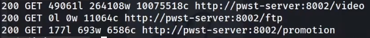

# 🔧 Tools and their Uses

### Takeover ([https://github.com/m4ll0k/takeover](https://github.com/m4ll0k/takeover))

```
python3 takeover.py -l all.txt -v
```

### Dalfox ([https://github.com/hahwul/dalfox](https://github.com/hahwul/dalfox))

```
dalfox file gf_xss.txt -w 50 --silence
```

### Breach-Parse ([https://github.com/hmaverickadams/breach-parse](https://github.com/hmaverickadams/breach-parse))

```
breach-parse @gmail.com gmail.txt
```

## Gau

```
xargs -a alive.txt -I@ sh -c 'gau --blacklist css,jpg,jpeg,JPEG,ott,svg,ttf,png,woff2,woff,eot,gif "@"' | tee -a gau.txt
```

## Dirsearch


```
dirsearch -e php,asp,aspx,jsp,py,txt,conf,config,bak,backup,swp,old,db,sqlasp,aspx,aspx~,asp~,py,py~,rb,rb~,php,php~,bak,bkp,cache,cgi,conf,csv,html,inc,jar,js,json,jsp,jsp~,lock,log,rar,old,sql,sql.gz,sql.zip,sql.tar.gz,sql~,swp,swp~,tar,tar.bz2,tar.gz,txt,wadl,zip -i 200 — full-url -u https://target --deep-recursive
```


```bash
#!/bin/bash

# Subdomain Enumeration Script

domain="$1"
output_dir="subdomain_enum_output"
resolvers_file="resolvers.txt"
wordlist_file="wordlist.txt"

if [ -z "$domain" ]; then
    echo "Usage: $0 <domain>"
    exit 1
fi

# Create the output directory if it doesn't exist
mkdir -p "$output_dir"

# AMASS with timeout, increased concurrency, resolvers, and brute-force enumeration
echo "[*] Running Amass..."
amass enum -d "$domain" -o "$output_dir/amass.txt" -max-dns-queries 200 -rf "$resolvers_file" -passive -brute -w "$wordlist_file" -timeout 15

# Rest of the subdomain enumeration tools...

# Knock
echo "[*] Running Knock..."
knockpy "$domain" -o "$output_dir/knock.txt"

# Sublist3r
echo "[*] Running Sublist3r..."
sublist3r -d "$domain" -o "$output_dir/sublist3r.txt"

# assetfinder (alternative to Anubis)
echo "[*] Running assetfinder..."
assetfinder --subs-only "$domain" | tee "$output_dir/assetfinder.txt"

# Subfinder
echo "[*] Running Subfinder..."
subfinder -d "$domain" -o "$output_dir/subfinder.txt"

# theHarvester
echo "[*] Running theHarvester..."
theHarvester -d "$domain" -l 500 -b all > "$output_dir/theharvester.txt"

# bbot
echo "[*] Running bbot..."
bbot -t "$domain" -f subdomain-enum -o "$output_dir/bbot"
find "$output_dir/bbot" -name "output.txt" -exec awk '/\[DNS_NAME\]/ {sub(/\[DNS_NAME\]\s+/, ""); print $1}' {} \; > "$output_dir/bbot.txt"
rm -rf "$output_dir/bbot"

# Amass Again for Comprehensive Results
echo "[*] Running Amass (Passive)..."
amass enum -passive -d "$domain" -o "$output_dir/amass_passive.txt"

# httprobe
echo "[*] Running httprobe..."
cat "$output_dir/"*".txt" | sort -u | httprobe -c 50 | tee "$output_dir/httprobe.txt"

echo "[+] Subdomain enumeration completed. Results saved in '$output_dir' directory."

```

```bash
#!/bin/bash
url=$1

if [ ! -d "$url" ];then
    mkdir "$url"
fi

if [ ! -d "$url/recon" ];then
    mkdir "$url/recon"
fi

if [ ! -d "$url/recon/scans" ];then
    mkdir "$url/recon/scans"
fi

if [ ! -d "$url/recon/httprobe" ];then
    mkdir "$url/recon/httprobe"
fi

if [ ! -d "$url/recon/potential_takeovers" ];then
    mkdir "$url/recon/potential_takeovers"
fi

if [ ! -d "$url/recon/wayback" ];then
    mkdir "$url/recon/wayback"
fi

if [ ! -d "$url/recon/wayback/params" ];then
    mkdir "$url/recon/wayback/params"
fi

if [ ! -d "$url/recon/wayback/extensions" ];then
    mkdir "$url/recon/wayback/extensions"
fi

if [ ! -f "$url/recon/httprobe/alive.txt" ];then
    touch "$url/recon/httprobe/alive.txt"
fi

if [ ! -f "$url/recon/final.txt" ];then
    touch "$url/recon/final.txt"
fi

echo "[+] Harvesting subdomains with assetfinder..."
assetfinder "$url" >> "$url/recon/assets.txt"
cat "$url/recon/assets.txt" | grep "$1" >> "$url/recon/final.txt"
rm "$url/recon/assets.txt"

echo "[+] Double checking for subdomains with amass..."
amass enum -passive -norecursive -noalts -d "$url" >> "$url/recon/f.txt"
subfinder -d "$url" -o "$url/recon/subfinder.txt" >> "$url/recon/f.txt"
sublist3r -d "$url"  -o "$url/recon/sublist3r.txt" >> "$url/recon/f.txt"

sort -u "$url/recon/f.txt" >> "$url/recon/final.txt"

rm "$url/recon/f.txt"

echo "[+] Probing for alive domains..."
cat "$url/recon/final.txt" | sort -u | httprobe -s -p https:443 | sed 's/https\?:\/\///' | tr -d ':443' >> "$url/recon/httprobe/a.txt"
sort -u "$url/recon/httprobe/a.txt" > "$url/recon/httprobe/alive.txt"
rm "$url/recon/httprobe/a.txt"

echo "[+] Checking for possible subdomain takeover..."
if [ ! -f "$url/recon/potential_takeovers/potential_takeovers.txt" ];then
    touch "$url/recon/potential_takeovers/potential_takeovers.txt"
fi

subjack -w "$url/recon/final.txt" -t 100 -timeout 30 -ssl -c ~/opt/subjack/fingerprints.json -v 3 -o "$url/recon/potential_takeovers/potential_takeovers.txt"

# echo "[+] Scanning for open ports..."
# nmap -iL "$url/recon/httprobe/alive.txt" -T4 -oA "$url/recon/scans/scanned.txt"

echo "[+] Scraping gau data..."
cat "$url/recon/final.txt" | gau --threads 20 --fc 404 --timeout 60 >> "$url/recon/wayback/wayback_output.txt"
sort -u "$url/recon/wayback/wayback_output.txt"

echo "[+] Pulling and compiling all possible params found in wayback data..."
cat "$url/recon/wayback/wayback_output.txt" | grep '?*=' | cut -d '=' -f 1 | sort -u >> "$url/recon/wayback/params/wayback_params.txt"
parallel -j 10 --delay 1 'echo {}=' >> "$url/recon/wayback/params/wayback_params.txt" :::: "$url/recon/wayback/params/wayback_params.txt"

echo "[+] Pulling and compiling js/php/aspx/jsp/json files from wayback output..."
cat "$url/recon/wayback/wayback_output.txt" | parallel -j 10 --delay 1 'ext={##*.}; if [[ "$ext" == "js" ]]; then echo {} >> "$url/recon/wayback/extensions/js1.txt"; sort -u "$url/recon/wayback/extensions/js1.txt" >> "$url/recon/wayback/extensions/js.txt"; elif [[ "$ext" == "html" ]]; then echo {} >> "$url/recon/wayback/extensions/jsp1.txt"; sort -u "$url/recon/wayback/extensions/jsp1.txt" >> "$url/recon/wayback/extensions/jsp.txt"; elif [[ "$ext" == "json" ]]; then echo {} >> "$url/recon/wayback/extensions/json1.txt"; sort -u "$url/recon/wayback/extensions/json1.txt" >> "$url/recon/wayback/extensions/json.txt"; elif [[ "$ext" == "php" ]]; then echo {} >> "$url/recon/wayback/extensions/php1.txt"; sort -u "$url/recon/wayback/extensions/php1.txt" >> "$url/recon/wayback/extensions/php.txt"; elif [[ "$ext" == "aspx" ]]; then echo {} >> "$url/recon/wayback/extensions/aspx1.txt"; sort -u "$url/recon/wayback/extensions/aspx1.txt" >> "$url/recon/wayback/extensions/aspx.txt"; fi' :::: "$url/recon/wayback/wayback_output.txt"

rm "$url/recon/wayback/extensions/js1.txt"
rm "$url/recon/wayback/extensions/jsp1.txt"
rm "$url/recon/wayback/extensions/json1.txt"
rm "$url/recon/wayback/extensions/php1.txt"
rm "$url/recon/wayback/extensions/aspx1.txt"

#echo "[+] Running eyewitness against all compiled domains..."
#python3 EyeWitness/EyeWitness.py --web -f "$url/recon/httprobe/alive.txt" -d "$url/recon/eyewitness" --resolve
```

## Subdomain Finder tools:

chaos , subfinder , finddomain, assetfinder, amass, crt.sh

## Feroxbuster sorting result example:

```
feroxbuster -u https://api.au1.defend.egress.com -w /usr/share/seclists/Discovery/Web-Content/common.txt -n -t 1
```

Feroxbuster is powerful and may, with defaults, overload your server! Be mindful of your option flags: `-L`, `-t`, and `--rate-limit` are your friends. You may want to start slow with `-L 1 -t 1` and a smaller wordlist to see how it goes.

```
egrep "^200" feroxbuster.txt | tr -s " " | cut -d " " -f 6

```

*   **egrep** - regular expression to give only those urls which have 200 in the beginning of the line.\


    <figure><figcaption></figcaption></figure>


*   **tr** - trim the spaces\


    <figure><figcaption></figcaption></figure>


*   **cut** - give cut the delimeter of single space using -d " " and then it asks for the the filed number by -f 6\


    <figure><figcaption></figcaption></figure>

## Sent the multiple urls to Burp or Zap using Command Line:&#x20;

```
egrep "^200" feroxbuster.txt | tr -s " " | cut -d " " -f 6 > filtered.txt
```

```
curl $(cat filtered.txt) --proxy http://localhost:8080
```

it will send all the urls requests to the configured proxy via web browser.

## FFUF Usage:

```
ffuf -p 0.1 -t 1 -w ~/wordlists/content.txt -u https://www.website.com
```

## User Agent:

```
[Mozilla/5.0 (X11; Linux i586; rv:31.0) Gecko/20100101 Firefox/31.0]
```

### Google Dorking (Information Gathering Tool)



